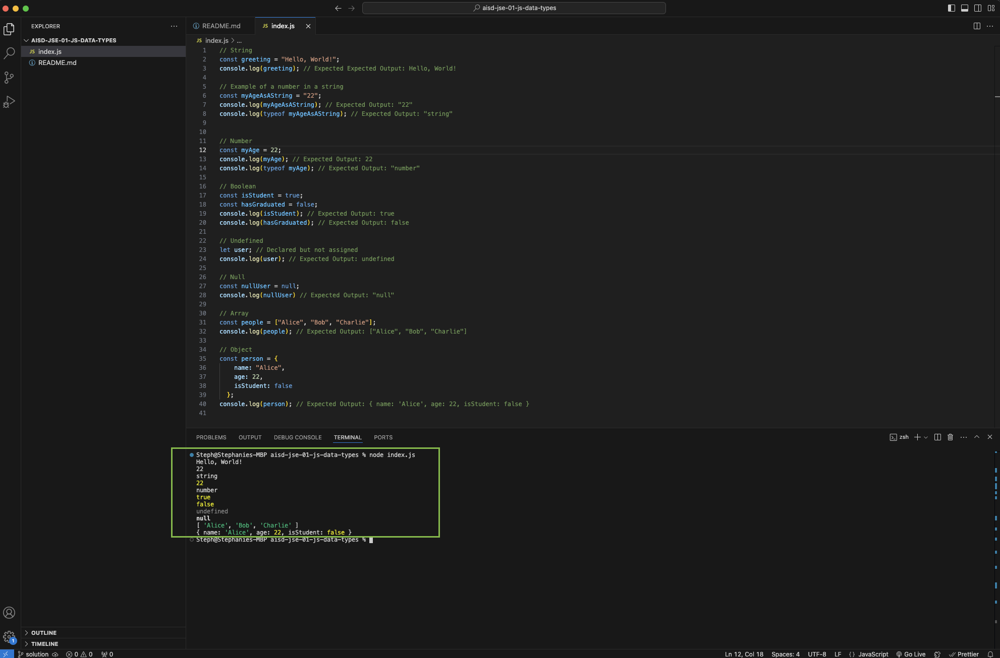

# Understanding JavaScript Data Types


## Description 📄

In this lab, you will learn about JavaScript's fundamental data types and how to create variables to store them. By the end, you will be familiar with various data types, including strings, numbers, booleans, undefined, and null. Additionally, you will be introduced to arrays and objects, which allow for more complex data storage and manipulation. [JavaScript Data Type Documentation](https://developer.mozilla.org/en-US/docs/Web/JavaScript/Data_structures).

## Expected Project Structure 🏗️

```
DataTypes/
└── index.js
```

# Instructions ✅

## 1. **Create the Project Folder and Files**

- [ ] Create a folder named `DataTypes` to store all your project files.
- [ ] Inside the `DataTypes` folder, create a file named `index.js`. This will be your main JavaScript file.

## 2. **Understand Variables**

Before diving into data types, it's important to understand variables. A variable is a container that stores data values. In JavaScript, variables are defined using keywords such as `let`, or `const`. For this lesson, we'll only be using `const` to define our variables. 

**Explanation:**

- `const` is used to define a variable that should not change. 
- It helps prevent accidental changes to the variable value later in the program.
- [JavaScript Variables Documentation](https://developer.mozilla.org/en-US/docs/Learn/JavaScript/First_steps/Variables).

## 3. **Define a String**

A `string` is a sequence of characters used to represent text. They are enclosed in single quotes (`'...'`) or double quotes (`"..."`).

- [ ] Add the following JavaScript variables to your `index.js` file to define a `string`:

```js
// String
const greeting = "Hello, World!";
console.log(greeting); // Expected Expected Output: Hello, World!

// Example of a number in a string
const myAgeAsAString = "22"; 
console.log(myAgeAsAString); // Expected Output: "22"
console.log(typeof myAgeAsAString); // Expected Output: "string"
```

**Explanation:**

- `"Hello, World!"` is a string, and `greeting` is the variable that stores this string value.
- `"22"` is also a string, and `myAgeAsAString` is the variable that stores this string value. 
- The `typeof` operator indicates that "22" is of type `string` because it is enclosed in quotes, even though it resembles a number. In JavaScript, any value within quotes is considered a `string` and treated as plain text, regardless of its content.

## 4. **Define a Number**

A `number` represents numeric data and can be either an integer (whole number) or a floating-point (decimal number).

- [ ] Add the following JavaScript variable to your `index.js` file to define a `number`:

```js
// Number
const myAge = 22;
console.log(myAge); // Expected Output: 22
console.log(typeof myAge); // Expected Output: "number"
```

**Explanation:**

- `myAge` is a variable that stores the numeric value `22.` The `typeof` operator confirms that `myAge` is of type `number`.
- Although `myAge` and `myAgeAsAString` represent the same numeric value `22`, they are different data types. myAgeAsAString is a string, while myAge is a number.

## 5. **Define a Boolean**

A `boolean` represents logical values and can be either `true` or `false`.

- [ ] Add the following JavaScript variable to your `index.js` file to define a `boolean`:

```js
// Boolean
const isStudent = true;
const hasGraduated = false;
console.log(isStudent); // Expected Output: true
console.log(hasGraduated); // Expected Output: false
```

**Explanation:**

- `true` and `false` are boolean values. `isStudent` and `hasGraduated` are variables storing these boolean values.

## 6. **Define an Undefined Variable**

`undefined` is a special data type that represents a variable that has been declared but not assigned a value.


- [ ] Add the following JavaScript variable to your `index.js` file to demonstrate an `undefined` value:

```js
// Undefined
let user; // Declared but not assigned
console.log(user); // Expected Output: undefined
```

**Explanation:**

- The variable `user` is declared but not given a value, so it is `undefined`.

## 7. **Define a Variable with a null Value**

`null` is a special value that represents "no value" or "nothing." It is intentionally set by the programmer to indicate that a variable has no value.

- [ ] Add the following JavaScript variable to your `index.js` file to demonstrate a `null` value:

```js
// Null
const nullUser = null;
console.log(nullUser) // Expected Output: "null"
```

**Explanation:**

- `nullUser` is explicitly set to `null`, indicating it has no value.

## 8. **Define an Array**

Arrays are ordered collections of other data types, allowing you to store multiple values in a single variable.

- [ ] Add the following JavaScript `array` to your `index.js` file:

```js
// Array
const people = ["Alice", "Bob", "Charlie"];
console.log(people); // Expected Output: ["Alice", "Bob", "Charlie"]
```

**Explanation:**

- `people` is an `array` containing three string elements: "Alice", "Bob", and "Charlie".
- `arrays` are useful for storing lists of items where each item is indexed by its position in the array. They are a type of object in JavaScript and provide many built-in methods for managing collections of data.
- [JavaScript W3 Schools Array Documentation](https://www.w3schools.com/jsref/jsref_obj_array.asp) and [JavaScript MDN Array Documentation](https://developer.mozilla.org/en-US/docs/Web/JavaScript/Reference/Global_Objects/Array).

## 9. **Define an Object**

Objects store related data as key-value pairs, allowing you to access data descriptively with named properties. Each property can have a different data type, making objects flexible for representing complex information.

- [ ] Add the following JavaScript `object` to your `index.js` file:

```js
// Object
const person = {
  name: "Alice",
  age: 22,
  isStudent: false
};
console.log(person); // Expected Output: { name: 'Alice', age: 22, isStudent: false }
```

**Explanation:**
- `person` is an `object` with three properties:
  -  `name`: Stores the person's name, which is a `string` ("Alice").
  - `age`: Stores the person's age, which is a `number` (22).
  - `isStudent`: Stores whether the person is a student, which is a `boolean` (false).

## 10. **Run Your Code**

- [ ] To see your code in action, you can run the `index.js` file in your terminal by using the following command:

```sh
node index.js
```

## Conclusion 📄

In this lab, you learned about different data types in JavaScript, including strings, numbers, booleans, undefined, and null. You also got a brief introduction to arrays and objects, which are more complex data types. Understanding these fundamental concepts is essential for building a solid foundation in JavaScript programming.

### Solution codebase 👀
🛑 **Only use this as a reference** 🛑

💾 **Not something to copy and paste** 💾

**Note:**  This lab references a solution file located [here](https://github.com/HackerUSA-CE/aisd-jse-01-js-data-types/tree/solution) (link not shown).


---

© All rights reserved to ThriveDX
